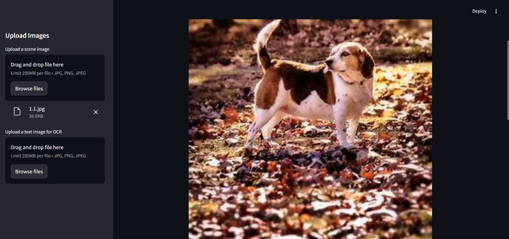
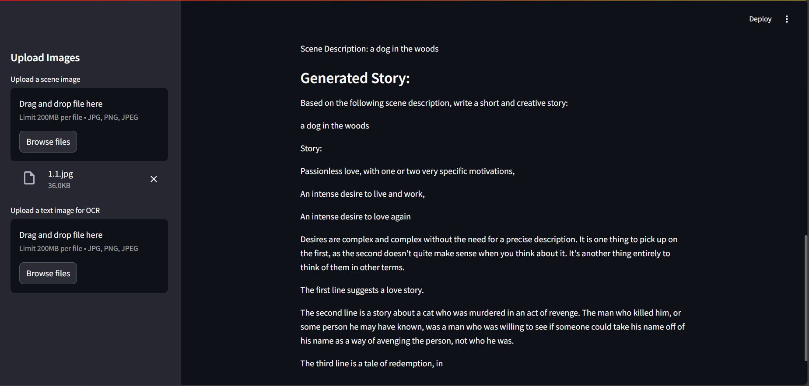
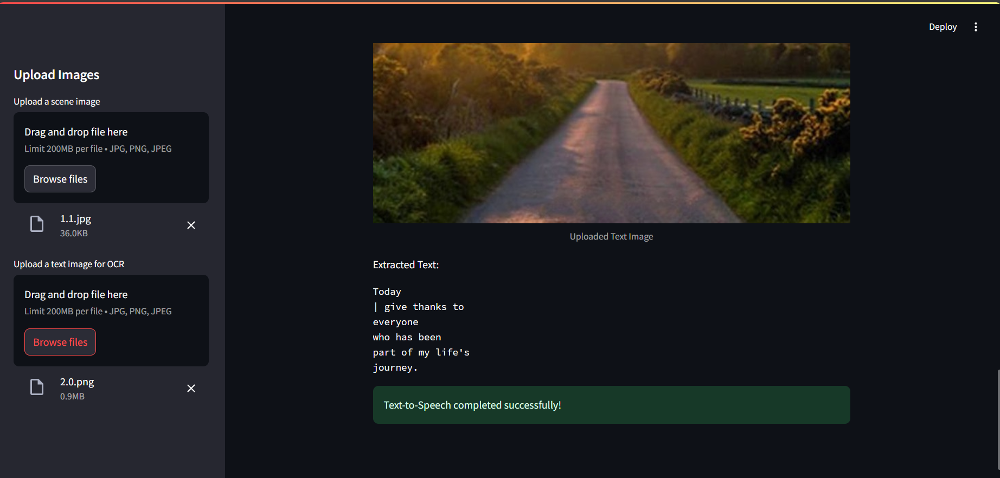

# Enhanced Image Processing App

This is a **Streamlit-based web application** that integrates multiple image processing functionalities. It allows users to perform **scene description**, **story generation**, **OCR (Optical Character Recognition)**, and **text-to-speech conversion**. The app is powered by cutting-edge machine learning models such as BLIP, GPT-2, and Tesseract OCR.

---

## Features

### 1. **Scene Description and Story Generation**

- **Scene Description**: Uses the BLIP model (`Salesforce/blip-image-captioning-base`) to generate a caption for an uploaded scene image.
- **Story Generation**: Leverages GPT-2 to generate a creative story based on the described scene.

### 2. **OCR (Optical Character Recognition)**

- Extracts text from uploaded text images using `pytesseract`.

### 3. **Text-to-Speech**

- Converts extracted text into speech using `gTTS` (Google Text-to-Speech).
- Outputs an audio file that can be played directly from the app.

---

## Technologies Used

### **Backend**

- [Streamlit](https://streamlit.io/) for building the interactive web app.
- [BLIP](https://huggingface.co/Salesforce/blip-image-captioning-base) for image captioning.
- [GPT-2](https://huggingface.co/gpt2) for text generation.
- [Tesseract OCR](https://github.com/tesseract-ocr/tesseract) for text extraction.
- [gTTS](https://pypi.org/project/gTTS/) for text-to-speech conversion.

### **Libraries**

- `numpy`
- `Pillow`
- `transformers`
- `cv2` (OpenCV)
- `os`

---

## Installation

### 1. Install Dependencies

- To install the required dependencies, run:

```bash
pip install -r requirements.txt
```

### 2. Install Tesseract OCR

#### 1. Download Tesseract

- Visit the [official Tesseract GitHub page](https://github.com/tesseract-ocr/tesseract) to download the correct version for your operating system.

- Install Tesseract and add it to your system PATH, or update the script to include the full path to the `tesseract.exe` file:

```bash
pytesseract.pytesseract.tesseract_cmd = r'C:\Program Files\Tesseract-OCR\tesseract.exe'
```

---

## Run the application

### 1. Start the app by running

```bash
streamlit run app.py
```

### 2. Open your browser and navigate to: `http://localhost:8501`

---

## OUTPUT

Below are sample outputs of the application:

**Scene Description & Story Generation:**



**Generated Story:**



**OCR and Text-to-Speech:**



---

## License

This project is open-sourced under the MIT License.
